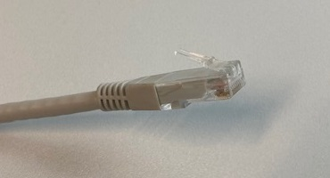
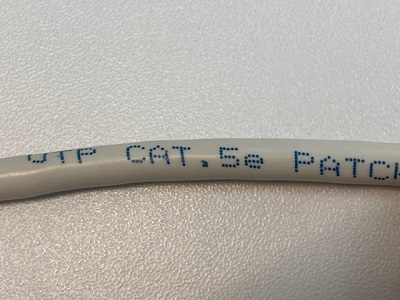
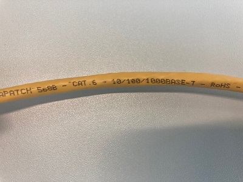
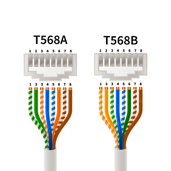

# Ethernet Cable

<style>body {text-align: justify}</style>

Ethernet cable is, with WiFi, one of the two most common ways to connect two devices. It's defined by the IEEE standard 802.3 and has been continuously improved over the years. Ethernet cable are the physical connection between two devices, and thus many issues are associated with it.

> 📍 Ethernet cables are often called RJ45 cables. RJ45 (RJ stands for Registered jack) is actually the standard for the connector. Another type of connector cable frequently found is RJ11, that is used for telephone lines.

Frequent issues :

- [Disconnected cable](#disconnected-cable)
- [Wrong port](#wrong-port)
- [Damaged cable](#damaged-cable)
- [Wrong cable category](#wrong-cable-category)
- [Straight through and crossover cable](#straight-through-and-crossover-cable)
- [Inproper duplex mode](#inproper-duplex-mode)
- [Incorrect speed](#incorrect-speed)
- [Incorrect MTU size](#incorrect-mtu-size)

## Disconnected cable

[//]: <> (Done)

This is the most stupid yet frequent issue. The cable is disconnected, and your device is not connected to the network. This happens all the time, and this should be the first thing you check.

### Symtoms

The device is not connected to the network.

### Diagnostics

Port LED of the switch is off. Port LED of the device is off. Cable is disconnected.

### Fixing

Ensure the cable is correctly connected.

## Wrong port

[//]: <> (To complete)

Some protocols such are VLAN are using ports to determice the device's access to the network. For this reason, it's important to check if you actually use the right port to connect your cable.

> ✔️ You can use NAC (Network Access Control) as a centralized system to manage the access to the network. Some manufacturers, such as Aruba, propose user-based tunneling. This enables a mobility gateway to provide a centralized security policy, using per-user authentication and access control to ensure consistent access and permissions. Consequently, this allow to connect a device to the network without worrying about the port.

### Symtoms

The device might have connection issue. The intended port might be shown as down. Your cable management might be a total mess.

### Diagnostics

Intended port LED is off. Commande `show port <port>` or `show interface status` shows the port is down.

```Cisco IOS

```

### Fixing

Check your wiring and reconnect the cable.

## Damaged cable

[//]: <> (To complete)

A damaged cable is always something that should be fixed. If the connector is damaged, the cable might plug into the port but he will eventually disconnect. If the cable is damaged, your cable might still works but you might have a lot of noises, thus causing packet loss.

### Symtoms

The device might have disconnection issue. The device might have packet loss.

### Diagnostics

The RJ45 connector is damaged or the cable is damaged.

|              Normal               |                   Broken                   |
| :-------------------------------: | :----------------------------------------: |
|  |  |

If the damage is inside the cable, you might have packet loss and reduced speed. Use the command `test cable-diagnostics tdr interface int <interface>` and `show cable-diagnostics tdr interface <interface>` to check the cable.

```Cisco IOS
Switch#test cable-diagnostics tdr interface int gi0/1
Switch#show cable-diagnostics tdr interface gigabitEthernet 0/1
TDR test last run on: February 25 11:18:31
Interface Speed Pair Cable length        Distance to fault   Channel Pair status
--------- ----- ---- ------------------- ------------------- ------- ------------
Gi0/1     1000  1-2  1    +/- 6  m       N/A                 Pair B  Normal
                3-4  1    +/- 6  m       N/A                 Pair A  Normal
                5-6  1    +/- 6  m       N/A                 Pair C  Normal
                7-8  1    +/- 6  m       N/A                 Pair D  Normal
```

For more information on this feature please refer to the [Documentation](#documentation) section.

### Fixing

Buy a new cable and replace the old one.

## Wrong cable category

[//]: <> (To do)

There is many cable categories standards. Using old cable that were build with different standards might cause congestion and packet loss.

Most common cable category standards are :

| Category | Standard Name  | Techincal Name | Standard Speed | Working Frequency |
| -------- | -------------- | -------------- | -------------- | ----------------- |
| Cat 3    | 802.3i (1990)  | 10BASE-T       | 10 Mbps        | 16 MHz            |
| Cat 5    | 802.3u (1995)  | 100BASE-TX     | 100 Mbps       | 100 MHz           |
| Cat 5    | 802.3ab (1999) | 1000BASE-T     | 1 Gbps         | 100 MHz           |
| Cat 5e   | 802.3bz (2016) | 2.5GBASE-T     | 2.5 Gbps       | 100 MHz           |
| Cat 6    | 802.3bz (2016) | 5GBASE-T       | 5 Gbps         | 250 MHz           |
| Cat 6A   | 802.3an (2006) | 10GBASE-T      | 10 Gbps        | 500 MHz           |

### Symtoms

Your link have a slowed down speed.

### Diagnostics

On Cisco IOS you can use the command `show interface status` to check the speed of the link. You can use `show interface <interface>`. You can also use the command `show cable-diagnostics tdr interface <interface>` to check the cable.

```Cisco IOS
Switch#show interface status

```

> 📍 `a-100` and `a-full` are preceded by `a-` because the speed and duplex mode of the link has been auto-negotiated.

> ⚠️ `show interface` indicate the speed available on the link and the speed that has been negotiated with the peer or the speed that has been configured on the interface. It doesn't always match the speed of the link. Furthermore, the negotiation process might be disable on the interface.

> ⚠️ A `10 Mbps` or `a-10` can indicate a device in standby mode. Once again, it doesn't always match the speed of the link.

For certain cable manufacturers, the cable category is written on the cable itself.

| Cat5e                              | Cat6                              |
| ---------------------------------- | --------------------------------- |
|  |  |

### Fixing

Change the cable to antoher cable with the right category.

## Straight through and crossover cable

[//]: <> (To do)

There is 2 kind of ethernet cables :

- Straight through cable
- Crossover cable

Straight through cable have the same end on both sides (T568A or T568B). Crossover cable have different ends on both sides (T568A and T568B).



Straight through cable are the most common cable type. They are used to connect 2 device that are not similar (Ex : PC and router). Crossover cable are used to connect 2 device that are similar (Ex : PC and PC, switch and switch). On modern NIC (Network Interface Card), there is a functionnality called Auto-MDIX (automatic medium-dependent interface crossover) that automatically adapt the NIC to the cable. Note that one interface with Auto-MDIX is enough to make the link up with any cable.

| Local Side Auto-MDIX | Remote Side Auto-MDIX | With Correct Cabling | With Incorrect Cabling |
| -------------------- | --------------------- | -------------------- | ---------------------- |
| On                   | On                    | Link up              | Link up                |
| On                   | Off                   | Link up              | Link up                |
| Off                  | On                    | Link up              | Link up                |
| Off                  | Off                   | Link up              | Link down              |

### Symtoms

Link is down. Auto MDIX is disabled or your device is very old.

### Diagnostics

Check if the Auto-MDIX is enabled on at least one interface of the link

```Cisco IOS

```

Check visually if the cable is a straight through cable or a crossover cable.

### Fixing

If possible, enable the Auto-MDIX on both interfaces of the link.

```Cisco IOS
Switch#configure terminal
Switch#interface gigabitEthernet 0/1
Switch#auto-mdix (mdix auto ?)
```

If not possible, replace the cable with the correct one.

## Inproper duplex mode

A link can be in 2 duplex mode :

- Full Duplex, the two devices are able to send and receive data at the same time.
- Half Duplex, the devices can send and receive data but not both at the same time.

10 or 100 Mbps links can work in both modes. 1 Gbps links only work in full duplex mode.
The duplex mode is usually automatically negotiated by the NIC. However, it can be manually configured on the interface.

### Symtoms

Your 1Gbs link work at a lower speed than expected. Your link might have a slightly increased latency.

### Diagnostics

Check the duplex mode of the link with the command `show interface <interface>`.

```Cisco IOS
Switch#show interface gigabitEthernet 0/1

```

### Fixing

Enable automatic duplex negotiation on the interface.

```Cisco IOS
Switch#configure terminal
Switch#interface gigabitEthernet 0/1
Switch#duplex auto
```

If you want to be sure the link works is full duplex, enable the full duplex mode on the link instead.

```Cisco IOS
Switch#configure terminal
Switch#interface gigabitEthernet 0/1
Switch#duplex full
```

## Inproper speed mode

The speed maximum speed of a link depends on the cable and the NIC. For example, on a 10/100/1000 Mbps NIC, the speed is limited can either be 10, 100 or 1000 Mbps. The speed is usually negotiated by the NIC. However, it can be manually configured on the interface.

### Diagnostics

Check the speed capability of the link with the command `show interface <interface> capabilities `.

```Cisco IOS
Switch#show interface gigabitEthernet 0/1 capabilities
GigabitEthernet0/1
  Model:                 VS-S720-10G
  Type:                  10/100/1000BaseT
  Speed:                 10,100,1000,auto
  Duplex:                half,full
  ...
```

Show the speed of the link with the command `show interface <interface>`.

```Cisco IOS
Switch#show interface gigabitEthernet 0/1

```

### Fixing

Enable automatic speed negotiation on the interface.

```Cisco IOS
Switch#configure terminal
Switch#interface gigabitEthernet 0/1
Switch#speed auto
```

If you want to be sure the link works at the maximum speed, manually set the speed of the link instead.

```Cisco IOS
Switch#configure terminal
Switch#interface gigabitEthernet 0/1
Switch#speed 1000
```

## Documentation

### General documentation

- https://en.wikipedia.org/wiki/IEEE_802.3
- https://en.wikipedia.org/wiki/Ethernet_over_twisted_pair
- https://en.wikipedia.org/wiki/Network_Access_Control

### Cisco IOS

- https://www.cisco.com/c/en/us/support/docs/switches/catalyst-6500-series-switches/12027-53.html
- https://www.cisco.com/c/en/us/td/docs/ios-xml/ios/fundamentals/command/cf_command_ref/test_cable-diagnostics_through_xmodem.html
- https://www.cisco.com/c/en/us/td/docs/ios-xml/ios/interface/command/ir-xe-3se-3850-cr-book/show_cable_diagnostics_tdr_through_switchport_voice_vlan.html#wp8029514250
- https://community.cisco.com/t5/networking-knowledge-base/how-to-use-time-domain-reflectometer-tdr/ta-p/3119327
- https://www.cisco.com/c/en/us/td/docs/switches/lan/catalyst9300/software/release/16-10/configuration_guide/int_hw/b_1610_int_and_hw_9300_cg/configuring_auto_mdix.pdf

### Aruba

- https://www.arubanetworks.com/techdocs/AOS-CX/10.08/HTML/fundamentals_4100i-6000-6100/Content/Chp_Dyn_Seg/use-bas-tun-10.-fl-ml.htm

### Image source

- https://www.freepik.com/premium-vector/rj45-crossover-pin-assignment-t568a-t568b-connections-types-infographic-scheme_8426527.htm
