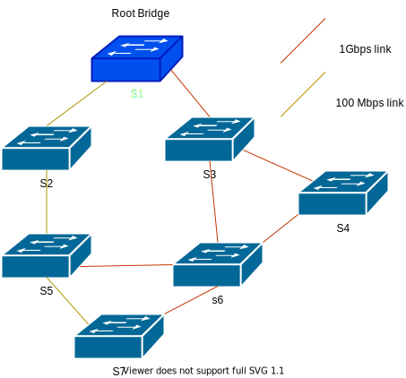
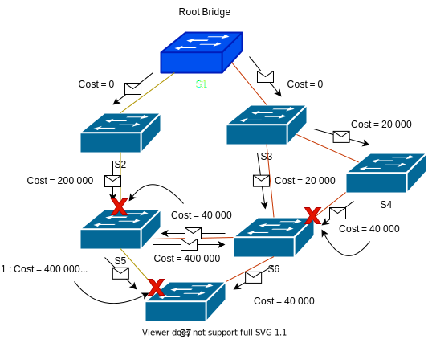

# Spanning Tree Protocol

The Spanning Tree Protocol (STP) is a protocol used to prevent loops in a network. It's a layer 2 protocol, and it allow network topology with redundancy to work properly. Loops are very bad for a network, because it can cause a broadcast storm, wich can lead to an denial of service.

The STP is a fairly complex protocol, that can adapt to any network topology and take into account bandwidth and constant updates. It works as follow :

1. **Election of a root bridge.**  
   The network start by electing a root bridge. For that, each switch look at their bridge priority value (by default on Cisco Switch, the value is 32768, and it's always a multiple of 4096), and the MAC address of the switch.
   Every switch communicate this informations to all their neighbors using BPDUs (Bridge Protocol Data Unit). BPDUs are a [multicast frame](MAC.md/#specials-mac-addresses), that are sent on the network using the MAC address 01:80:C2:00:00:00 . The switch with the lowest bridge priority value is elected root bridge, but if there is a tie the switch with the lowest MAC address is elected. All other switches will be called non-root switches.

2. **Calculating Port Cost**  
   Each switch calculate the cost of each port, based on the bandwidth of the port. The cost is calculated using the formula : `Cost = 20 Tbps / Bandwidth`. For example, if the bandwidth of a port is 100Mbps, the cost will be `20 Tbps / 100 Mbps = 200000`. Port cost can also be set manually.

> 📍 This formula is actually true for RSTP (Rapid Spanning Tree Protocol) that was created in 2011 to improve the original STP. The original STP use the formula `Cost = 1 Gbps / Bandwidth`.

3. **Calculating Path Cost**  
   The root switch send a BPDUs to all its neighbors with a path cost of 0. Upon receiving it, the non-root switch add the cost value from the port it received the BPDU to the path cost value. 2 cases can now happen :

   - If it's the first BPDU he received, he then proceed to send the BPDU with this new cost value to all his neighbors except to the one he received the BPDU from.
   - If he already received a BPDU from another port, this mean there is a loop and he need to decide what interface to disable. He compare the new cost value with the old one :
     - If the new cost value is lower, he disable the old port and send the BPDU with the new cost value to all his neighbors except to the one he received the BPDU from.
     - If the new cost value is higher, he drop the BPDU and do nothing.

   Here is an example :

   

   Let's calculate how STP will be applied.

   - S2 and S3 are directly connected to the root bridge S1 so STP will not block them, they receive the initial BPDU with a cost of 0.
   - S3 transmit it's BPDU to S6 and S4 and S2 transmit it's BPDU to S5, so far so good.
   - S4 sent it's BPDU to S6. S6 then got 2 BPDU, he choose the path (S2-S6) with the best cost and block the other (S4-S6).
   - S5 receive the BPDU from S2 and transmit it to S6 and S7. S6 already had a better path so he drop the BPDU
   - S5 receive the BPDU from S6. It's a better path that the one he got from S2, so he block the link S2-S5.
   - S7 receive q first BPDU from S5. He receive a second one from S6, and he is better than the one he got from S5, so he block the link S5-S7. He then receive another one from S5-S7, but the cost is higher so he drop it.

   

> 📍 Note that S5 isn't connected to the root bridge (S1) by the shortest path, but it's the best path for the network in term of cost.

## Documentation

https://www.ciscopress.com/articles/article.asp?p=2832407&seqNum=4
