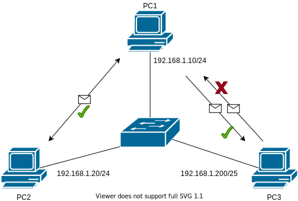

# Internet Protocol

IP addresses are logical addresses that identify a host on a network. They are composed of 2 main parts:

- the address (encoded over 4 bytes). It is represented as 4 decimal numbers separated by dots, for example: 192.168.1.1.
- the subnet mask (also encoded over 4 bytes). It is represented as 4 decimal numbers separated by dots, for example: 255.255.255.0; or as a decimal number that represent the number of bit set to 1, for example: 24. Here is a table that shows the number of bits set to 1 for each subnet mask:

| Subnet Mask with dot | Equivalent in /X |
| -------------------- | ---------------- |
| 255.0.0.0            | 8                |
| 255.128.0.0          | 9                |
| 255.192.0.0          | 10               |
| 255.224.0.0          | 11               |
| 255.240.0.0          | 12               |
| 255.248.0.0          | 13               |
| 255.252.0.0          | 14               |
| 255.254.0.0          | 15               |
| 255.255.0.0          | 16               |
| ...                  | ...              |
| 255.255.255.252      | 30               |

The final representation of an IP is `{address}/{mask in decimal}` : `192.168.1.1/24`, or `{address} {mask in decimal separator by dot}` : `192.168.1.1 255.255.255.0`.

The mask is used to determine if a host is on the same network as another host. To do so, we use the AND operator between the address and the mask. Imagine that 192.168.1.10/24 want to communicate with 192.168.1.250/24. Are they in the same network?

|                                     | Address 1     | Address 2     |
| ----------------------------------- | ------------- | ------------- |
| Address                             | 192.168.1.10  | 192.168.1.250 |
| Mask                                | 255.255.255.0 | 255.255.255.0 |
| Result after logical & (network ID) | 192.168.1.0   | 192.168.1.0   |

The result is the same as the address, so they are in the same network. If not they are in different networks.

The mask determines the number of hosts that can be connected to the network. For example, if the mask is 30, there is 2<sup>(32-30)</sup> = 2<sup>2</sup> = 4 IP in the network. However, the first IP is the network ID (the result after the logical &), and the last is for broadcast. So the number available IP for the hosts is 2<sup>(32-30)</sup>-2 = 2<sup>2</sup>-2 = 2. As a general rule, the number of available IP is **2<sup>(32-mask)</sup>-2**. For exemple for a /24 network, there is 2<sup>(32-24)-2\*\* = 2<sup>8</sup>-2 = 254 IP available for the hosts.

Frequent issues :

- [IP duplicate](#ip-duplicate)
- [Incorrect mask](#incorrect-mask)
- [Incorrect IP](#incorrect-ip)
- [Incorrect gateway](#incorrect-gateway)
- [Using special IPs](#using-special-ips)
- [Broadcast storm](#broadcast-storm)

## IP duplicate

[//]: <> (To complete)

See your network as a city and the IP as the address of a building. If you want to send a letter to a building but 2 buildings have the same address, you can't be sure which one will receive it. The same is true for a network.

Duplicate IPs are a frequent issue in networks and can sometimes be a bit difficult to identify.

### Symptoms

All layer 3+ protocols are highly unstable. Frequent diconnections and packet loss. [ARP](ARP.md) request are sent continuously and the network is not stable.

[//]: <> (Make the test using VMs on GN3 to get error messages)

### Diagnosis

Use [ARP](ARP.md) with the IP you suspect being duplacated and count the number of replies. If the number is 1, the IP is unique. Else you have a duplicate.
[ICMP](ICMP.md) might answer with a diffrent TTL (Time To Live) every few seconds.

[//]: <> (Add screenshot/cmd)

### Fixing

Modify the incorrect IP with the right one or disable the interface that has the duplicate IP.

## Incorrect mask

[//]: <> (To complete)

An incorrect mask is also a frequent issue. As explained in the introduction, the mask is used to determine if a host is on the same network as another host. Therefore, if the mask is incorrect, the hosts might fail to communicate with other device on his network.

[//]: <> (TO DO : Test with a GW)

Let's take the folowing example: your network is a star topology composed of 3 PC whose IP are 192.168.1.10/24, 192.168.1.20/24 and 192.168.1.200/25 and a L2 switch. PC1 and 2 are correctly configured and can both communicate. But what happens if PC1 want to reach PC3 ? PC1 uses his mask and PC3's IP to determine if they are both on the same network : 192.168.1.200/24 -> 192.168.1.0, it's the same network ID as PC1 so PC1 can reach PC3 directly. For PC3 however, PC3 uses his mask and PC1's IP to determine if they are on the same network : 192.168.1.10/25 -> 192.168.1.0, but PC3's network ID is 192.168.1.128. For PC3, PC1 isn't in the same network, so PC3 can't reach PC1 directly and need a gateway.



### Symptoms

The device that has the incorrect mask will not be able to communicate with all the other devices on the network.

### Diagnosis

Login on the suspected device and check network configuration.

On Windows, you can use the command `ipconfig` or `netsh interface ipv4 show config`.

```Bash
C:\Users\MyUser>ipconfig

Windows IP Configuration


Ethernet adapter Ethernet0:

   Connection-specific DNS Suffix  . : xxx.xx
   Link-local IPv6 Address . . . . . : fe80::1%5
   IPv4 Address. . . . . . . . . . . : 192.168.1.200
   Subnet Mask . . . . . . . . . . . : 255.255.255.128
   Default Gateway . . . . . . . . . : 192.168.1.254

```

[//]: <> (Linux)
On Linux you can use the command `ip a`.

```Shell
$ ip a

```
