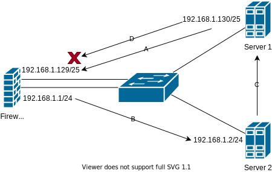

# Internet Protocol

<style>body {text-align: justify}</style>

IP addresses are logical addresses that identify a host on a network. They are composed of 2 main parts:

- the address (encoded over 4 bytes). It is represented as 4 decimal numbers separated by dots, for example: 192.168.1.1.
- the subnet mask (also encoded over 4 bytes). It is represented as 4 decimal numbers separated by dots, for example: 255.255.255.0; or as a decimal number that represent the number of bit set to 1, for example: 24. Here is a table that shows the number of bits set to 1 for each subnet mask:

| Subnet Mask with dot | Equivalent in /X |
| -------------------- | ---------------- |
| 255.0.0.0            | 8                |
| 255.128.0.0          | 9                |
| 255.192.0.0          | 10               |
| 255.224.0.0          | 11               |
| 255.240.0.0          | 12               |
| 255.248.0.0          | 13               |
| 255.252.0.0          | 14               |
| 255.254.0.0          | 15               |
| 255.255.0.0          | 16               |
| 255.255.128.0        | 17               |
| 255.255.192.0        | 18               |
| 255.255.224.0        | 19               |
| 255.255.240.0        | 20               |
| 255.255.248.0        | 21               |
| 255.255.252.0        | 22               |
| 255.255.254.0        | 23               |
| 255.255.255.0        | 24               |
| 255.255.255.128      | 25               |
| 255.255.255.192      | 26               |
| 255.255.255.224      | 27               |
| 255.255.255.240      | 28               |
| 255.255.255.248      | 29               |
| 255.255.255.252      | 30               |

The final representation of an IP is `{address}/{mask in decimal}` : `192.168.1.1/24`, or `{address} {mask in decimal separator by dot}` : `192.168.1.1 255.255.255.0`.

The mask is used to determine if a host is on the same network as another host. To do so, we use the AND operator between the address and the mask. Imagine that 192.168.1.10/24 want to communicate with 192.168.1.250/24. Are they in the same network?

|                                     | Address 1     | Address 2     |
| ----------------------------------- | ------------- | ------------- |
| Address                             | 192.168.1.10  | 192.168.1.250 |
| Mask                                | 255.255.255.0 | 255.255.255.0 |
| Result after logical & (network ID) | 192.168.1.0   | 192.168.1.0   |

The result is the same as the address, so they are in the same network. If not they are in different networks.

The mask determines the number of hosts that can be connected to the network. For example, if the mask is 30, there is 2<sup>(32-30)</sup> = 2<sup>2</sup> = 4 IP in the network. However, the first IP is the network ID (the result after the logical &), and the last is for broadcast. So the number available IP for the hosts is 2<sup>(32-30)</sup>-2 = 2<sup>2</sup>-2 = 2. As a general rule, the number of available IP is **2<sup>(32-mask)</sup>-2**. For exemple for a /24 network, there is 2<sup>(32-24)</sup>-2 = 2<sup>8</sup>-2 = 254 IP available for the hosts.

Frequent issues :

- [IP duplicate](#ip-duplicate)
- [Incorrect mask](#incorrect-mask)
- [Incorrect IP](#incorrect-ip)
- [Incorrect gateway](#incorrect-gateway)
- [Using special IPs](#using-special-ips)
- [Broadcast storm](#broadcast-storm)

## IP duplicate

[//]: <> (To complete)

See your network as a city and the IP as the address of a building. If you want to send a letter to a building but 2 buildings have the same address, you can't be sure which one will receive it. The same is true for a network.

Duplicate IPs are a frequent issue in networks and can sometimes be a bit difficult to identify.

> ⚠️ Duplicate IP can still happen even if you use DHCP. In order to verify if an IP is already used, a DHCP server uses [ICMP](ICMP.md) ping request. If something blocks the ping request, for example an [ACL](../Layer%204/ACL.md) or a [Firewall](../Layer%204/Firewall.md), the DHCP server gets no anwer and the IP is considered as unused

### Symptoms

All layer 3+ protocols are highly unstable. Frequent diconnections and packet loss. [ARP](ARP.md) request are sent continuously and the network is not stable.

[//]: <> (Make the test using VMs on GN3 to get error messages)

### Diagnosis

Use [ARP](ARP.md) with the IP you suspect being duplacated and count the number of replies. If the number is 1, the IP is unique. Else you have a duplicate.
[ICMP](ICMP.md) might answer with a diffrent TTL (Time To Live) every few seconds.

[//]: <> (Add screenshot/cmd)

### Fixing

Modify the incorrect IP with the right one or disable the interface that has the duplicate IP.

## Incorrect mask

[//]: <> (To complete)

An incorrect mask is also a frequent issue. As explained in the introduction, the mask is used to determine if a host is on the same network as another host. Therefore, if the mask is incorrect, the hosts might fail to communicate with other device on his network.

### Examples

#### Example 1

Let's take the folowing example : your network is a star topology composed of 3 PC whose IP are 192.168.1.10/24, 192.168.1.20/24 and 192.168.1.200/25 and a L2 switch. PC1 and 2 are correctly configured and can both communicate. But what happens if PC1 want to reach PC3 ? PC1 uses his mask and PC3's IP to determine if they are both on the same network : 192.168.1.200/24 -> 192.168.1.0, it's the same network ID as PC1 so PC1 can reach PC3 directly. For PC3 however, PC3 uses his mask and PC1's IP to determine if they are on the same network : 192.168.1.10/25 -> 192.168.1.0, but PC3's network ID is 192.168.1.128. For PC3, PC1 isn't in the same network, so PC3 can't reach PC1 directly and need a gateway.


#### Example 2

[//]: <> (TO DO : Test with a GW)

#### Example 3

Let's take a look to another example, based on a real life case I had. The network is composed of a Firewall, a L2 switch and 2 servers, configured as follow :



As you might see, this infrastructure is already fucked-up. The dealbreaker is that the firewall, that is working at the session layer, was configured to log only when the sessions ends. So what happens when Server 1 want to reach Server 2 ? Server 1 calculate that Server 2 isn't in the same network and send the packet to his gateway (A) that is the firewall. The firewall log the packet and sent it to Server 2 (B). Then when Server 2 receive the packet, it calculate that Server 1 **IS** in the same network and send it to Server 1 (C) directly, not passing by the firewall. The firewall is then completely confuse and think that the session never established, he then proceed to block Server 1 and Server 2 from communicating (D). The tricky part is that we spent a lot of time trying to figure out why the firewall is doing this, until we saw that packet where only going one way trough the firewall. Note that using [VLAN](../Layer%202/VLAN.md) could also help to solve this issue.

### Symptoms

The device that has the incorrect mask will not be able to communicate with all the other devices on the network.

### Diagnosis

Login on the suspected device and check network configuration.

On Windows, you can use the command `ipconfig` or `netsh interface ipv4 show config`.

```Bash
C:\Users\MyUser>ipconfig

Windows IP Configuration


Ethernet adapter Ethernet0:

   Connection-specific DNS Suffix  . : xxx.xx
   Link-local IPv6 Address . . . . . : fe80::1%5
   IPv4 Address. . . . . . . . . . . : 192.168.1.200
   Subnet Mask . . . . . . . . . . . : 255.255.255.128
   Default Gateway . . . . . . . . . : 192.168.1.254

```

[//]: <> (Linux)
On Linux you can use the command `ip a`.

```Shell
$ ip a

```

### Fixing

Change the mask

## Incorrect IP

[//]: <> (To complete)

## Incorrect gateway

[//]: <> (To complete)

## Using special IPs

[//]: <> (To complete)

There are multiples range of IPs that are reserved for special purposes.

| IP subnet      | Usage                     |
| -------------- | ------------------------- |
| 10.0.0.0/8     | Private network           |
| 172.16.0.0/12  | Private network           |
| 192.168.0.0/16 | Private network           |
| 127.0.0.0/8    | Loopback network          |
| 169.254.0.0/16 | Autoconfiguration network |
| 224.0.0.0/4    | Multicast network         |
| 100.64.0.0/10  | Shared address space      |

First of all, there are the 3 privates IP ranges. These ranges are used for private networks and are not routable on the internet. Theses range are used on your home internet connection, in your company or in your school. You can use any IP in these ranges freely, but you can't access the internet with them.

Then there is the loopback network. This network is used to test the network configuration. It's a network that is only accessible from the device itself. There are used for services that are localy hosted on the device. The loopback network is also used to test that your network interface card is working properly.

The autoconfiguration network is used by [DHCP](DHCP.md) to assign an IP to a device. If a device can't get an IP from a DHCP server, it will use this range to assign an IP to itself. This IP is not routable on the internet. If you see an IP in this range, it means that you have a DHCP connectivity issue.

The multicast network is used for multicast communication. Multicast is a communication method that allows a device to send a message to multiple devices at the same time. This network is used for video streaming, video conferencing, etc. These IP can't be used to address devices. Take a look at the documentation for multicast address for more information.

The shared address space is used for carrier-grade NAT. Carrier-grade NAT is a NAT method that allows a device to have multiple public IP. This is used by big companies that have a lot of devices that need to be accessible from the internet. This IP can't be used to address devices.

Any IP that are not in these ranges are called public IP. Public IP are sold by the IANA (Internet Assigned Numbers Authority) and are used to address devices on the internet. You can't use any IP in these ranges freely, you need to buy them from the IANA. Even if you technically can use any IP in these ranges in your private network with [NAT](./NAT.md), it's not recommended as this will prevent you to communicate with the public server that already use these IP and it's complete bad practice. You should only use the private IP ranges in your private network. Note that the public IP pool is exhausted and that you can't really buy any IP anymore, and we should move to IPv6.

You might say that there is no chance someone ever incorrectly uses one of these IPs. Until you get an infra in production, using 172.14.0.0/15 for their private network...

### Symptoms

## Documentation

- http://www.iana.org/help/abuse-answers
- Details about multicast addresses : https://www.rfc-editor.org/rfc/rfc3171
- https://en.wikipedia.org/wiki/Multicast_address
